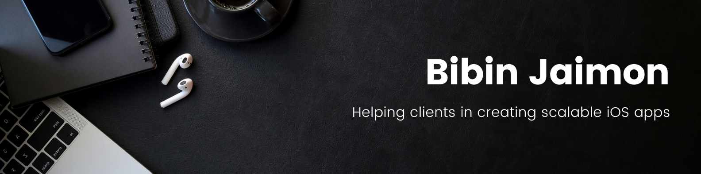
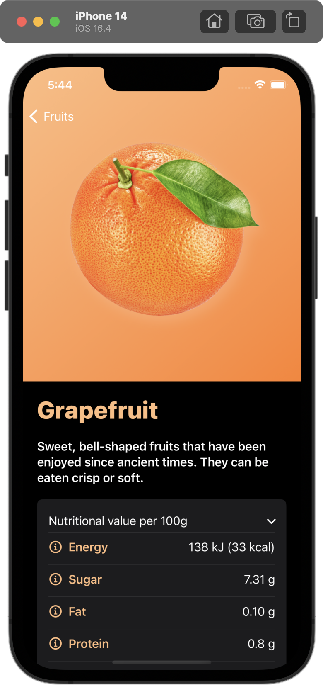
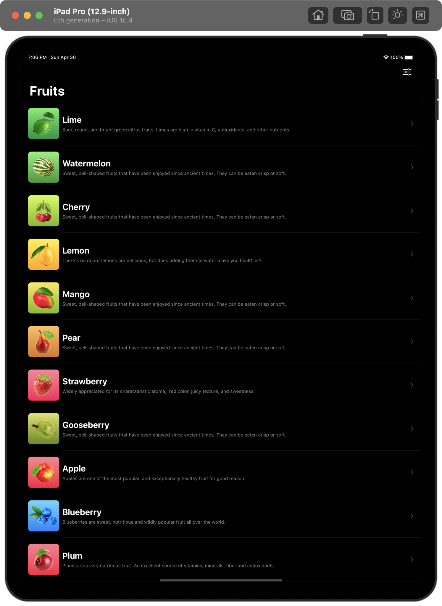
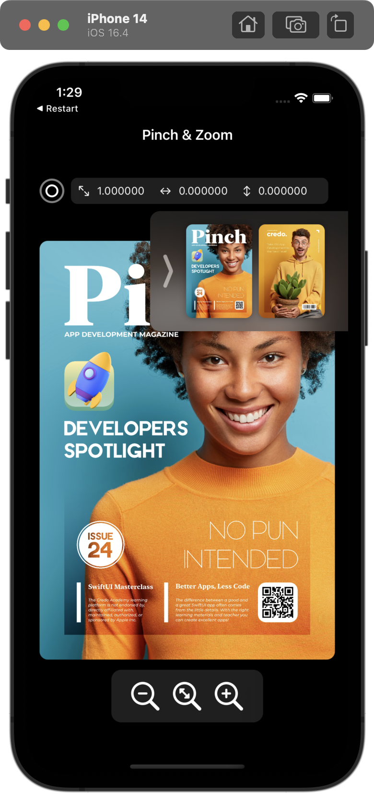
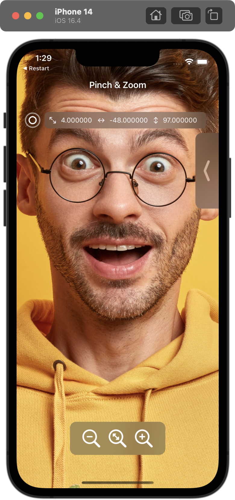
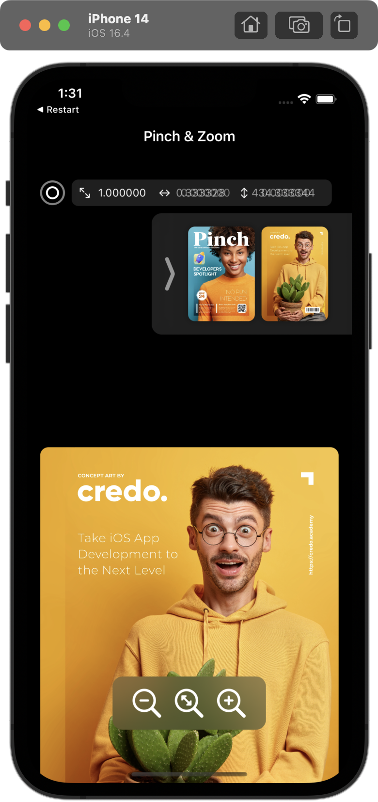
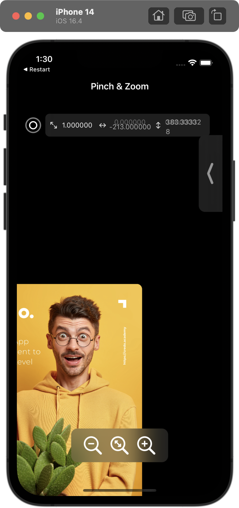
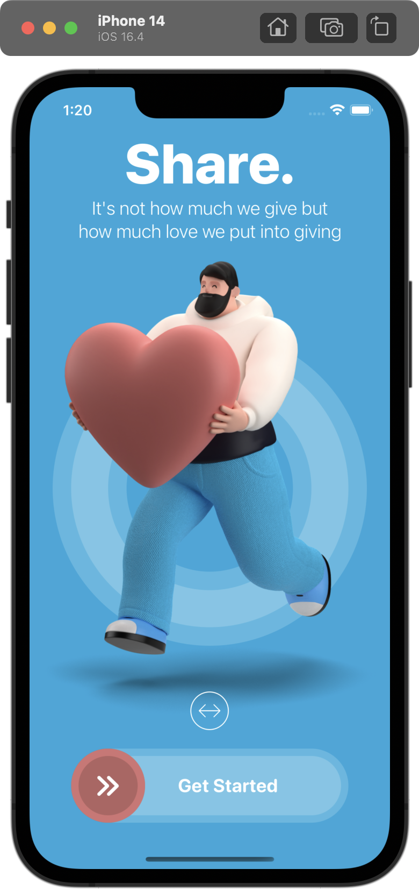
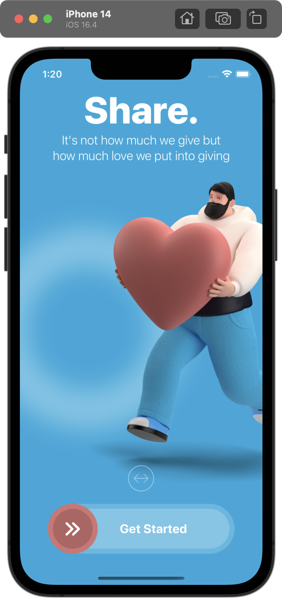

</img>
# Bibin Jaimon - iOS Developer Portfolio | SwiftUI
- [Gmail](mailto:bibinjaimon@gmail.com) - bibinjaimon@gmail.com
- [LinkedIn](https://www.linkedin.com/in/bibinjaimon/)
- [DEV.to](https://dev.to/bibinjaimon)
- [LeetCode](https://leetcode.com/bibinjaimon/)
- [StackOverflow](https://stackoverflow.com/users/4591087/bibin-jaimon)
## Skills

- Swift | JavaScript | TypeScript
- SwiftUI | UIKit | CocoaTouch | React Native
- MVVM | MVC
- Coordinator Pattern | SOLID Principle | Problem Solving | Algorithms and Data Structure

## Projects

 
Multi app workspace setup project - SPM | SwiftUI

- This project consist of 3 apps in one workspace. The modularization is done with SPM and XCFrameworks. Tech used is SwiftUI.
- Code: https://github.com/bibin-jaimon/multi-app-setup-swiftui-2023/

#### Fructs

<table>
<td width="25%">
</img>
</td>
<td width="25%">
</img>
</td>
<td width="25%">
</img>
</td>
<td width="25%">
</img>
</td>
</tr>
</table>

<table>
<td width="25%">
</img>
</td>
<td width="25%">
</img>
</td>
<td width="25%">
</img>
</td>
<td width="25%">
</img>
</td>
</tr>
</table>

#### Pinch App - SwiftUI

<table>
<td width="25%">
</img>
</td>
<td width="25%">
</img>
</td>
<td width="25%">
</img>
</td>
<td width="25%">
</img>
</td>
</tr>
</table>

#### Restart App - SwiftUI

<table>
<td width="25%">
</img>
</td>
<td width="25%">
</img>
</td>
<td width="25%">
</img>
</td>
<td width="25%">
</img>
</td>
</tr>
</table>

Apple Wallet Home Clone - ReactNative | TypeScript

 
- Demo: https://youtu.be/eJoyWtnbn_I
- Code: https://github.com/bibin-jaimon/rn-wallet
 

## Professional Experience [2018 - Present]

| Company | Role | Duration |
| --- | --- | --- |
| [Deloitte Digital](https://www2.deloitte.com/us/en.html) | Consultant | Mar 2022 - Present
| [Vymo](https://vymo.com/) | Member Of Technical Staff | Sep 2021 - Mar 2022
| [QBurst](https://www.qburst.com/) | Senior Engineer | May 2018 - Sep 2021

## Online Certifications
- [Blockchain Specialization](https://coursera.org/share/fd64d4ad80af14fd1efa013a25bb0a48) | Ethereum | Solidity | Web3.js
- SwiftUI Masterclass 2023 - iOS App Development & Swift | Udemy | Pursuing

## Education

- B. Tech in Computer Science and Engineering | Kannur University | 2014 - 2018
