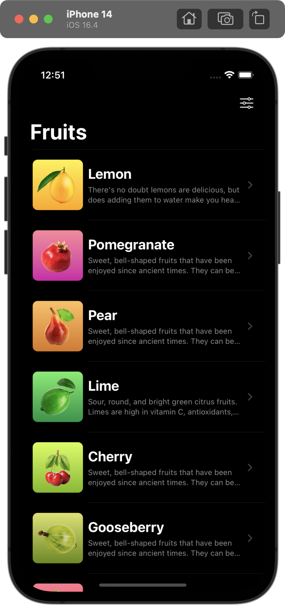
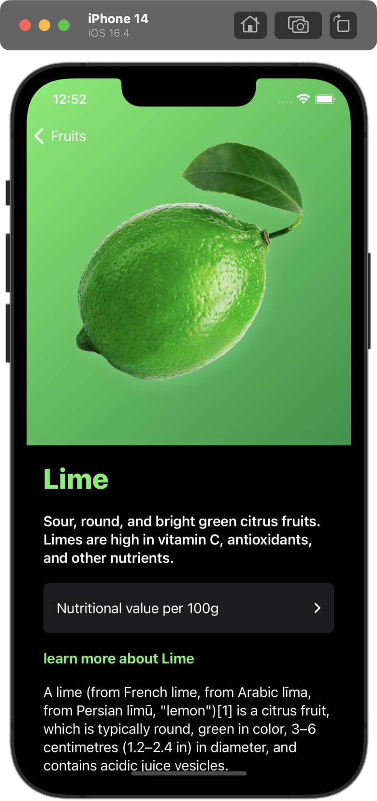
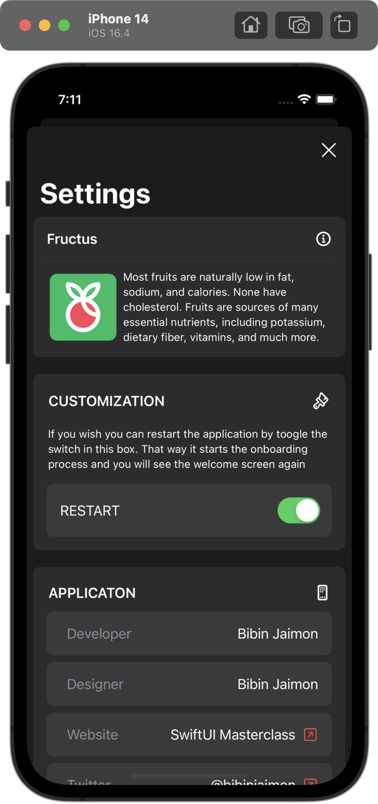
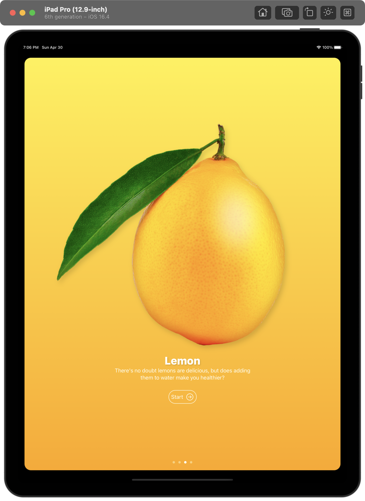
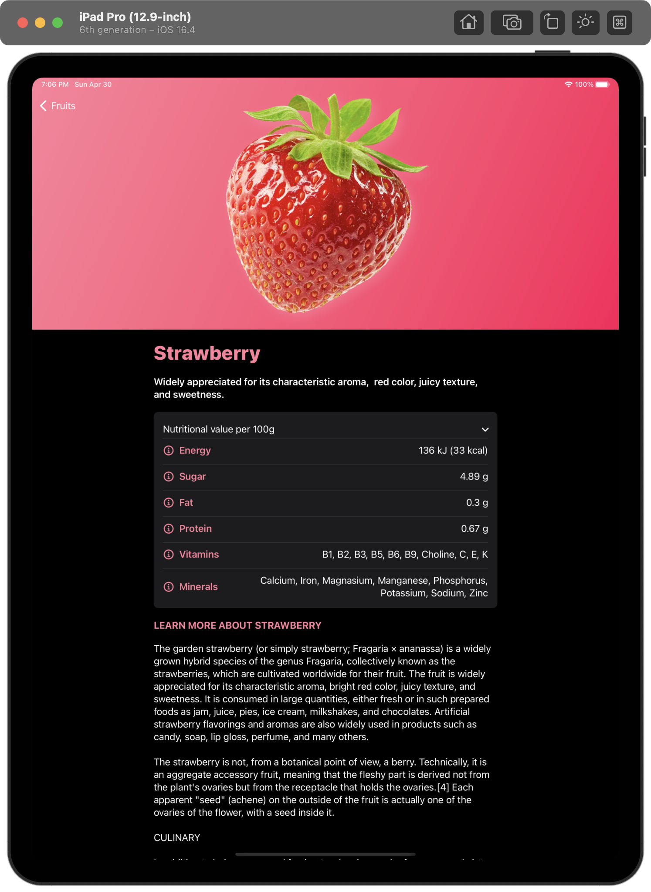
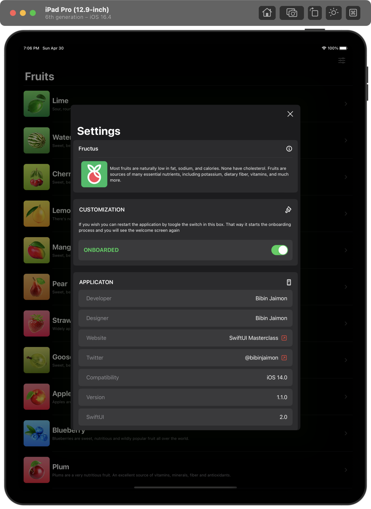
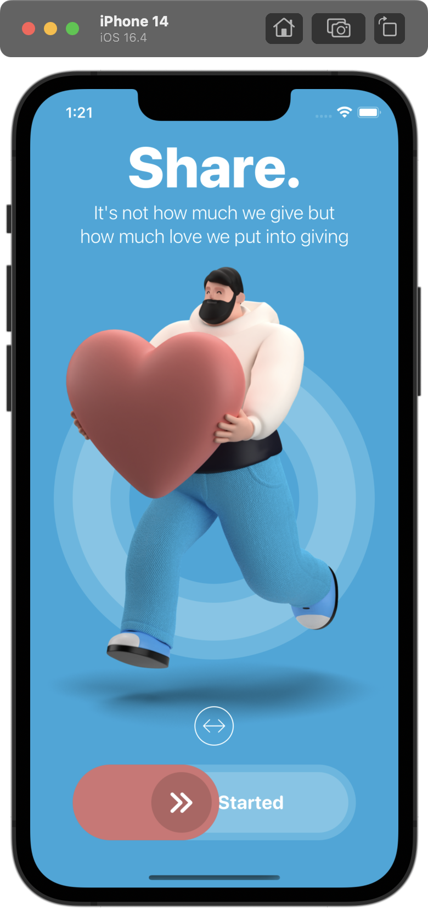
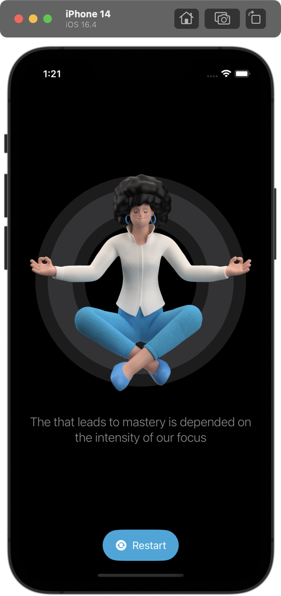

# Bibin Jaimon - iOS Developer Portfolio | SwiftUI

## Fructus App - SwiftUI

<table>
<td width="25%">
</img>
</td>
<td width="25%">
</img>
</td>
<td width="25%">
</img>
</td>
<td width="25%">
</img>
</td>
</tr>
</table>

<table>
<td width="25%">
</img>
</td>
<td width="25%">
</img>
</td>
<td width="25%">
</img>
</td>
<td width="25%">
</img>
</td>
</tr>
</table>

## Pinch App - SwiftUI

<table>
<td width="25%">
</img>
</td>
<td width="25%">
</img>
</td>
<td width="25%">
</img>
</td>
<td width="25%">
</img>
</td>
</tr>
</table>

## Restart App - SwiftUI

<table>
<td width="25%">
</img>
</td>
<td width="25%">
</img>
</td>
<td width="25%">
</img>
</td>
<td width="25%">
</img>
</td>
</tr>
</table>

Email address: bibinjaimon@gmail.com 

LeetCode: https://leetcode.com/bibinjaimon/

DEV.to: https://dev.to/bibinjaimon

LinkedIn: https://www.linkedin.com/in/bibinjaimon/

## Skills

Swift | SwiftUI | JavaScript | React Native

MVVM | MVC | Coordinator Pattern

SOLID Principle

Problem Solving

Algorithms and Data Structure

## Experience

 [Deloitte Digital](https://www2.deloitte.com/us/en.html) (Consultant) | Mar 2022 - Present

 [Vymo](https://vymo.com/) (Member Of Technical Staff) | Sep 2021 - Mar 2022

 [QBurst](https://www.qburst.com/) (Senior Engineer) | May 2018 - Sep 2021

## Online Certifications

SwiftUI Masterclass 2023 - iOS App Development & Swift | Udemy | Pursuing

## Education

B. Tech in Computer Science and Engineering | Kannur University | 2014 - 2018
